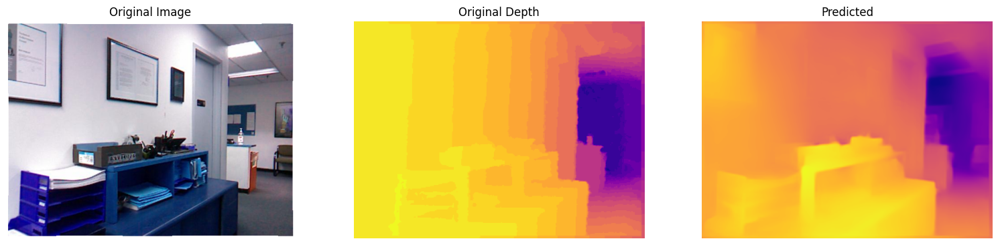

# Monocular Depth Estimation using Modified UNet

MonocularDepthEstimationUsingUNet is a deep learning project that implements monocular depth estimation using a U-Net architecture. The model takes a single RGB image as input and predicts its corresponding depth map, enabling scene understanding from 2D images without stereo input.
---

## Table of Contents

1. [Overview](#overview)
2. [Features](#features)
3. [Dependencies](#dependencies)
4. [Setup Instructions](#setup-instructions)
5. [Usage](#usage)
6. [How It Works](#how-it-works)
7. [Example Results](#example-results)
8. [Contributing](#contributing)
9. [License](#license)

---

## Overview

An optimized U-Net architecture was developed for Depth Estimation, using DenseNet-121 as a pre-trained encoder. Transfer learning was applied using the NYU V2 Dataset, training on a subset of 10,000 images. 

---

---

## Required Dependencies

Ensure you have the following installed before running the project:

- Jupyter Notebook
- OpenCV
- Tensorflow
- Tensorboard
- OpenCV
- NumPy
- Pandas
- Matplotlib

---

## Setup Instructions

1. **Clone the Repository**

   Clone this repository to your local machine using the following command:

   ```bash
   git clone https://github.com/tayyabwahab/MonocularDespthEstimationUsingUNet.git
   ```

2. **Navigate to the Project Directory**

   ```bash
   cd MonocularDespthEstimationUsingUNet
   ```
3. **Setting up Virtual Environment**

   It is recommended to use a virtual environment to avoid conflicts with other projects.

   ```bash
   pip install virtualenv    # Install virtualenv to create virtual environments1
   virtualenv VEnv           # Create Virtual Environment
   source VEnv/bin/activate  # Activate Virtual Environment (On Windows use `VEnv\Scripts\activate)`
   ```

4. **Install Dependencies**

   Use the provided command to install all required libraries:

   ```bash
   pip install -r requirements.txt
   ```

5. **Install Jupyter Notebook**

   Ensure Jupyter Notebook is installed to run the code:

   ```bash
   pip install notebook
   ```
---

---

## Dataset

The [NYU-DepthV2](https://cs.nyu.edu/~fergus/datasets/nyu_depth_v2.html) consists of sequence of images generated from the video from a variety of indoor scenes as recorded by both the RGB and Depth cameras. It contains 50,000+ sequence of labeled images out of which the model was trained on a subset of 10,000 images that are available [here](https://drive.google.com/drive/u/2/folders/1p5PjjuzRzDvpL0X-li3agnJ_og-iod-7). 

---

---

## Usage

1. **How to run**

   Open the Jupyter notebook and execute the cells sequentially:

   ```bash
   jupyter notebook
   ```

   - Open the notebook file named `Depth_Estimation_UNety.ipynb`.
   - Set the paths to dataset.
   - Run each cell one by one. 
   - The trained model can be downloaded from [here](https://drive.google.com/file/d/1-5dt9Q4-bC-PD4oxneZmGNx_sjfcgeqw/view)

2. **Adjust Parameters**

   Following hyperparameters were adjusted for training:
   - Learning rate = Adaptive (initial lr=0.0001)
   - Batch size = 8
   - Epochs = 20
   - Optimizer = Adam
   - Learning rate scheduler = Exponential decay

---

---

## Results

Below are the results of test images demonstrating the model's output:





---
